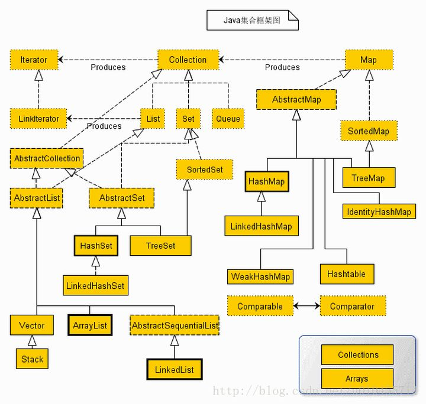

# JavaTips

[TOC]

## Java常见的容器类



容器常用的方法有:

```java
boolean add(Object obj):向容器中添加指定的元素
Iterator iterator()：返回能够遍历当前集合中所有元素的迭代器
Object[] toArray():返回包含此容器中所有元素的数组。
Object get(int index)：获取下标为index的那个元素
Object remove(int index)：删除下标为index的那个元素
Object set(int index,Object element)：将下标为index的那个元素置为element
Object add(int index,Object element)：在下标为index的位置添加一个对象element
Object put(Object key,Object value):向容器中添加指定的元素
Object get(Object key)：获取关键字为key的那个对象
int size():返回容器中的元素数
```

常见的容器类有以下这些:

Java容器类库是用来保存对象的，他有两种不同的概念：

- Collection，独立元素的序列，这些元素都服从一条或多条规则。List、Set以及Queue都是Collection的一种，List必须按照顺序保存元素，而Set不能有重复元素，Queue需要按照排队规则来确定对象的顺序。
- Map，Map是键值对类型，允许用户通过键来查找对象。Hash表允许我们使用另一个对象来查找某个对象。

### Collection 

　├List 
　│--├LinkedList 
　│--├ArrayList 
　│--└Vector 
　│     └Stack 

　├Set 
　│--├HashSet 
　│--├TreeSet 
　│--└LinkedSet 

　├Queue 
　│	└Deque


#### Queue和Deque

---

- Deque继承Queue。
- Queue接口,是集合框架Collection的子接口，是一种常见的数据结构，遵循先进先出的原则。基于链表来进行实现，的单向队列。LinkedList接口，实现了Queue，所以LinkedList，在插入和删除操作，效率会比较高。
- Deque接口（双向队列），是Queue接口的子接口，是指队列两端的元素，既能入队（offer）也能出队。
  如果将Deque限制为只能从一端进行入队，和出队，就是栈的数据结构的实现。对于栈而言，有入栈（push）和出栈（pop），遵循先进后出的规则。

```java
使用方式:
Deque<T> deque = new LinkedList<T>();
Deque<T> deque = new ArrayDeque<T>();
---
Queue<T> queue = new LinkedList<T>();
```

```java
常用方法
poll()：将队首的元素删除，并返回该元素。
peek()：返回队首的元素，但不进行删除操作。
offer()：将元素添加到队尾，如果成功，则返回true。
```


### Map 

　├-HashMap 
　│	└LinkedHashMap
　├-Hashtable 
　├-TreeMap 
　└-WeakHashMap


#### HashMap 

HashMap 是一个散列表，它存储的内容是键值对(key-value)映射。

HashMap 中的元素实际上是对象，一些常见的基本类型可以使用它的包装类。

HashMap 实现了 Map 接口，根据键的 HashCode 值存储数据，具有很快的访问速度，最多允许一条记录的键为 null，不支持线程同步。

HashMap 是无序的，即不会记录插入的顺序。要维护顺序可以使用LinkedHashMap。

---

HashMap的主干是一个Entry数组。Entry是HashMap的基本组成单元，每一个Entry包含一个key-value键值对。（其实所谓Map其实就是保存了两个对象之间的映射关系的一种集合）

```java
//HashMap的主干数组，可以看到就是一个Entry数组，初始值为空数组{}，主干数组的长度一定是2的次幂。
transient Entry<K,V>[] table = (Entry<K,V>[]) EMPTY_TABLE;
```

简单来说，**HashMap由数组+链表组成的**，数组是HashMap的主体，链表则是主要为了解决哈希冲突而存在的。

---

```java
//一种遍历方法
for (Map.Entry<Integer, Integer> entry : hashMap.entrySet()) {}
```


| 方法                                                         | 描述                                                         |
| :----------------------------------------------------------- | :----------------------------------------------------------- |
| [clear()](https://www.runoob.com/java/java-hashmap-clear.html) | 删除 hashMap 中的所有键/值对                                 |
| [clone()](https://www.runoob.com/java/java-hashmap-clone.html) | 复制一份 hashMap                                             |
| [isEmpty()](https://www.runoob.com/java/java-hashmap-isempty.html) | 判断 hashMap 是否为空                                        |
| [size()](https://www.runoob.com/java/java-hashmap-size.html) | 计算 hashMap 中键/值对的数量                                 |
| [put()](https://www.runoob.com/java/java-hashmap-put.html)   | 将键/值对添加到 hashMap 中                                   |
| [putAll()](https://www.runoob.com/java/java-hashmap-putall.html) | 将所有键/值对添加到 hashMap 中                               |
| [putIfAbsent()](https://www.runoob.com/java/java-hashmap-putifabsent.html) | 如果 hashMap 中不存在指定的键，则将指定的键/值对插入到 hashMap 中。 |
| [remove()](https://www.runoob.com/java/java-hashmap-remove.html) | 删除 hashMap 中指定键 key 的映射关系                         |
| [containsKey()](https://www.runoob.com/java/java-hashmap-containskey.html) | 检查 hashMap 中是否存在指定的 key 对应的映射关系。           |
| [containsValue()](https://www.runoob.com/java/java-hashmap-containsvalue.html) | 检查 hashMap 中是否存在指定的 value 对应的映射关系。         |
| [replace()](https://www.runoob.com/java/java-hashmap-replace.html) | 替换 hashMap 中是指定的 key 对应的 value。                   |
| [replaceAll()](https://www.runoob.com/java/java-hashmap-replaceall.html) | 将 hashMap 中的所有映射关系替换成给定的函数所执行的结果。    |
| [get()](https://www.runoob.com/java/java-hashmap-get.html)   | 获取指定 key 对应对 value                                    |
| [getOrDefault()](https://www.runoob.com/java/java-hashmap-getordefault.html) | 获取指定 key 对应对 value，如果找不到 key ，则返回设置的默认值 |
| [forEach()](https://www.runoob.com/java/java-hashmap-foreach.html) | 对 hashMap 中的每个映射执行指定的操作。                      |
| [entrySet()](https://www.runoob.com/java/java-hashmap-entryset.html) | 返回 hashMap 中所有映射项的集合集合视图。                    |
| [keySet](https://www.runoob.com/java/java-hashmap-keyset.html)() | 返回 hashMap 中所有 key 组成的集合视图。                     |
| [values()](https://www.runoob.com/java/java-hashmap-values.html) | 返回 hashMap 中存在的所有 value 值。                         |
| [merge()](https://www.runoob.com/java/java-hashmap-merge.html) | 添加键值对到 hashMap 中                                      |
| [compute()](https://www.runoob.com/java/java-hashmap-compute.html) | 对 hashMap 中指定 key 的值进行重新计算                       |


## String、StringBuffer 与 StringBuilder

三者的主要区别如下:

| String                                                       | StringBuffer                                                 | StringBuilder    |
| :----------------------------------------------------------- | :----------------------------------------------------------- | :--------------- |
| String的值是不可变的，这就导致每次对String的操作都会生成新的String对象，不仅效率低下，而且浪费大量优先的内存空间 | StringBuffer是可变类，和线程安全的字符串操作类，任何对它指向的字符串的操作都不会产生新的对象。每个StringBuffer对象都有一定的缓冲区容量，当字符串大小没有超过容量时，不会分配新的容量，当字符串大小超过容量时，会自动增加容量 | 可变类，速度更快 |
| 不可变                                                       | 可变                                                         | 可变             |
|                                                              | 线程安全                                                     | 线程不安全       |
|                                                              | 多线程操作字符串                                             | 单线程操作字符串 |

- 首先说运行速度，或者说是执行速度，**在这方面运行速度快慢为：StringBuilder > StringBuffer > String**


## PriorityQueue 优先队列

​	Java中PriorityQueue通过二叉小顶堆实现，可以用一棵完全二叉树表示。

​	Java中*PriorityQueue*实现了*Queue*接口，不允许放入`null`元素；其通过堆实现，具体说是通过完全二叉树（*complete binary tree*）实现的**小顶堆**（任意一个非叶子节点的权值，都不大于其左右子节点的权值），也就意味着可以通过数组来作为*PriorityQueue*的底层实现。


​	**优先队列的作用是能保证每次取出的元素都是队列中权值最小的**（Java的优先队列每次取最小元素，C++的优先队列每次取最大元素）。这里牵涉到了大小关系，**元素大小的评判可以通过元素本身的自然顺序（natural ordering），也可以通过构造时传入的比较器**（*Comparator*，类似于C++的仿函数）。

```java
PriorityQueue<int[]> priorityQueue = new PriorityQueue<>(new Comparator<int[]>() {
            @Override
            public int compare(int[] o1, int[] o2) {
                return o1[1] - o2[1];
            }
        });
```

---

常用方法:

1. `add()`和`offer()`

   ​	add(E e)和offer(E e)的语义相同，都是向优先队列中插入元素，只是`Queue`接口规定二者对插入失败时的处理不同，前者在插入失败时抛出异常，后则则会返回`false`。对于*PriorityQueue*这两个方法其实没什么差别。

2. `element()`和`peek()`

   ​	element()和peek()的语义完全相同，都是获取但不删除队首元素，也就是队列中权值最小的那个元素，二者唯一的区别是当方法失败时前者抛出异常，后者返回`null`。根据小顶堆的性质，堆顶那个元素就是全局最小的那个；由于堆用数组表示，根据下标关系，`0`下标处的那个元素既是堆顶元素。所以**直接返回数组`0`下标处的那个元素即可**。

3. `remove()`和`poll()`

   ​	remove()和poll()方法的语义也完全相同，都是获取并删除队首元素，区别是当方法失败时前者抛出异常，后者返回`null`。由于删除操作会改变队列的结构，为维护小顶堆的性质，需要进行必要的调整。

4. `remove(Object o)`

   ​	remove(Object o)方法用于删除队列中跟`o`相等的某一个元素（如果有多个相等，只删除一个），该方法不是*Queue*接口内的方法，而是*Collection*接口的方法。由于删除操作会改变队列结构，所以要进行调整；又由于删除元素的位置可能是任意的，所以调整过程比其它函数稍加繁琐。


## equals 以及 ==

1、“==”比较两个变量本身的值，即两个对象在内存中的首地址。

​	(java中，对象的首地址是它在内存中存放的起始地址，它后面的地址是用来存放它所包含的各个属性的地址，所以内存中会用多个内存块来存放对象的各个参数，而通过这个首地址就可以找到该对象，进而可以找到该对象的各个属性)

2、“equals()”比较字符串中所包含的内容是否相同。

​	StringBuffer类中没有重新定义equals这个方法，因此这个方法就来自Object类，(Object类中的equals方法是用来比较“地址”的，所以等于false)

3、equals方法对于字符串来说是比较内容的，而对于非字符串来说是比较，其指向的对象是否相同的。

4、== 比较符也是比较指向的对象是否相同的也就是对象在对内存中的的首地址。

5、String类中重新定义了equals这个方法，而且比较的是值，而不是地址。所以是true。

6、如果是基本类型比较，那么只能用==来比较，不能用equals ==

7、对于基本类型的包装类型，比如Boolean、Character、Byte、Shot、Integer、Long、Float、Double等的引用变量，==是比较地址的，而equals是比较内容的。

## 二维数组重写排序方法

```java
/*
Parameters:
	o1 - the first object to be compared.
	o2 - the second object to be compared.
Returns:
	a negative integer, zero, or a positive integer as the first argument is less than, equal to, or greater than the second.
    从小到大排序 o1 - o2
    从大到小排序 o2 - o1
*/
Arrays.sort(intervals,new Comparator<int[]>(){
            @Override
            public int compare(int[] o1, int[] o2) {
                return o1[0]-o2[0];
            }
        });
```


## 创建一棵二叉树

依据层次遍历的数组，创建一棵二叉树。

给定二叉树 [3,9,20,null,null,15,7]，

```
    3
   / \
  9  20
    /  \
   15   7
```

```java
import java.util.ArrayDeque;
public class TreeNode {
    int val;
    TreeNode left;
    TreeNode right;
    TreeNode() {}
    TreeNode(int val) {this.val = val;}
    TreeNode(int val, TreeNode left, TreeNode right) {
        this.val = val;
        this.left = left;
        this.right = right;
    }

    public TreeNode Build(Integer[] leaf) {
        if (leaf.length == 0) {
            return null;
        }
        TreeNode root = new TreeNode(leaf[0]);
        ArrayDeque<TreeNode> treeNodes = new ArrayDeque<>();
        treeNodes.addLast(root);
        int index = 1;
        while (!treeNodes.isEmpty()) {
            TreeNode temp = treeNodes.pollFirst();
            if (index >= leaf.length) {
                return root;
            }
            if (leaf[index] != null ) {
                TreeNode leftNode = new TreeNode(leaf[index++]);
                temp.left = leftNode;
                treeNodes.addLast(leftNode);
            }else {
                index++;
                temp.left = null;
            }
            if (index >= leaf.length) {
                return root;
            }
            if (leaf[index] != null ) {
                TreeNode rightNode = new TreeNode(leaf[index++]);
                temp.right = rightNode;
                treeNodes.addLast(rightNode);
            }else {
                index++;
                temp.right = null;
            }
        }
        return root;
    }
}
```

## 字符串转整型边界

```java
Integer.valueOf(tokens[i]);		//字符串转整型
String.valueOf(12);				//整型转字符串
```

在 Java 中：

- 如果字符串超过 33 位，不能转化为 `Integer`
- 如果字符串超过 65 位，不能转化为 `Long`
- 如果字符串超过 500000001 位，不能转化为 `BigInteger`


## ArrayDeque类的使用详解

- `ArrayDeque`是`Deque`接口的一个实现，使用了可变数组，所以没有容量上的限制。
- 同时，`ArrayDeque`是线程不安全的，在没有外部同步的情况下，不能再多线程环境下使用。
- `ArrayDeque`是`Deque`的实现类，可以作为栈来使用，效率高于`Stack`；
- 也可以作为队列来使用，效率高于`LinkedList`。
- 需要注意的是，`ArrayDeque`不支持`null`值。

```java
	1.添加元素
        addFirst(E e)在数组前面添加元素
        addLast(E e)在数组后面添加元素
        offerFirst(E e) 在数组前面添加元素，并返回是否添加成功
        offerLast(E e) 在数组后天添加元素，并返回是否添加成功
    2.删除元素
        removeFirst()删除第一个元素，并返回删除元素的值,如果元素为null，将抛出异常
        pollFirst()删除第一个元素，并返回删除元素的值，如果元素为null，将返回null
        removeLast()删除最后一个元素，并返回删除元素的值，如果为null，将抛出异常
        pollLast()删除最后一个元素，并返回删除元素的值，如果为null，将返回null
        removeFirstOccurrence(Object o) 删除第一次出现的指定元素
        removeLastOccurrence(Object o) 删除最后一次出现的指定元素
   	3.获取元素
        getFirst() 获取第一个元素,如果没有将抛出异常
        getLast() 获取最后一个元素，如果没有将抛出异常
    4.队列操作
    	add(E e) 在队列尾部添加一个元素
    	offer(E e) 在队列尾部添加一个元素，并返回是否成功
    	remove() 删除队列中第一个元素，并返回该元素的值，如果元素为null，将抛出异常(其实底层调用的是removeFirst())
    	poll()  删除队列中第一个元素，并返回该元素的值,如果元素为null，将返回null(其实调用的是pollFirst())
    	element() 获取第一个元素，如果没有将抛出异常
   		peek() 获取第一个元素，如果返回null
    5.栈操作
    	push(E e) 栈顶添加一个元素
    	pop(E e) 移除栈顶元素,如果栈顶没有元素将抛出异常
    6.其他
    	size() 获取队列中元素个数
    	isEmpty() 判断队列是否为空
    	iterator() 迭代器，从前向后迭代
    	descendingIterator() 迭代器，从后向前迭代
    	contain(Object o) 判断队列中是否存在该元素
    	toArray() 转成数组
    	clear() 清空队列
    	clone() 克隆(复制)一个新的队列
```


