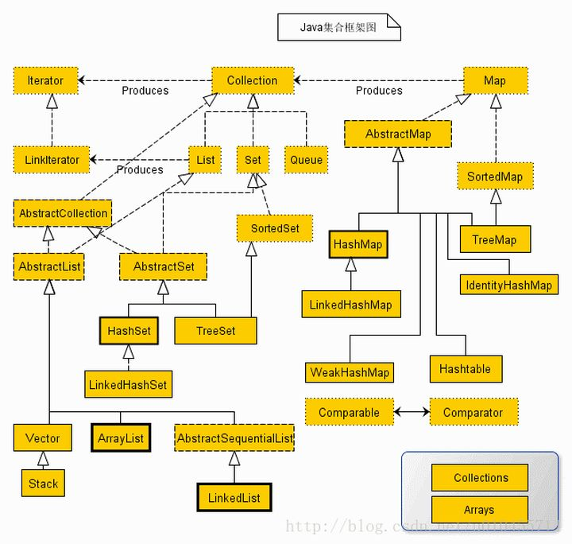

# JavaTips

[TOC]

## Java常见的容器类



容器常用的方法有:

```java
boolean add(Object obj):向容器中添加指定的元素
Iterator iterator()：返回能够遍历当前集合中所有元素的迭代器
Object[] toArray():返回包含此容器中所有元素的数组。
Object get(int index)：获取下标为index的那个元素
Object remove(int index)：删除下标为index的那个元素
Object set(int index,Object element)：将下标为index的那个元素置为element
Object add(int index,Object element)：在下标为index的位置添加一个对象element
Object put(Object key,Object value):向容器中添加指定的元素
Object get(Object key)：获取关键字为key的那个对象
int size():返回容器中的元素数
```

常见的容器类有以下这些:

Java容器类库是用来保存对象的，他有两种不同的概念：

- Collection，独立元素的序列，这些元素都服从一条或多条规则。List、Set以及Queue都是Collection的一种，List必须按照顺序保存元素，而Set不能有重复元素，Queue需要按照排队规则来确定对象的顺序。
- Map，Map是键值对类型，允许用户通过键来查找对象。Hash表允许我们使用另一个对象来查找某个对象。

### Collection 

　├List 
　│--├LinkedList 
　│--├ArrayList 
　│--└Vector 
　│     └Stack 

　├Set 
　│--├HashSet 
　│--├TreeSet 
　│--└LinkedSet 

　├Queue 
　│	└Deque


#### Queue和Deque

---

- **Deque继承Queue。**
- **Queue接口,是集合框架Collection的子接口，是一种常见的数据结构，遵循先进先出的原则。基于链表来进行实现，的单向队列。LinkedList接口，实现了Queue，所以LinkedList，在插入和删除操作，效率会比较高。**
- **Deque接口（双向队列），是Queue接口的子接口，是指队列两端的元素，既能入队（offer）也能出队。
  如果将Deque限制为只能从一端进行入队，和出队，就是栈的数据结构的实现。对于栈而言，有入栈（push）和出栈（pop），遵循先进后出的规则。**

```java
使用方式:
Deque<String> deque = new LinkedList<String>();
Queue<T> queue = new LinkedList<T>();
```

```java
常用方法
poll()：将队首的元素删除，并返回该元素。
peek()：返回队首的元素，但不进行删除操作。
offer()：将元素添加到队尾，如果成功，则返回true。
```


### Map 

　├-HashMap 
　│	└LinkedHashMap
　├-Hashtable 
　├-TreeMap 
　└-WeakHashMap


## 创建一棵二叉树

依据层次遍历的数组，创建一棵二叉树。

给定二叉树 [3,9,20,null,null,15,7]，

```
    3
   / \
  9  20
    /  \
   15   7
```

```java
import java.util.ArrayDeque;
public class TreeNode {
    int val;
    TreeNode left;
    TreeNode right;
    TreeNode() {}
    TreeNode(int val) {this.val = val;}
    TreeNode(int val, TreeNode left, TreeNode right) {
        this.val = val;
        this.left = left;
        this.right = right;
    }

    public TreeNode Build(Integer[] leaf) {
        if (leaf.length == 0) {
            return null;
        }
        TreeNode root = new TreeNode(leaf[0]);
        ArrayDeque<TreeNode> treeNodes = new ArrayDeque<>();
        treeNodes.addLast(root);
        int index = 1;
        while (!treeNodes.isEmpty()) {
            TreeNode temp = treeNodes.pollFirst();
            if (index >= leaf.length) {
                return root;
            }
            if (leaf[index] != null ) {
                TreeNode leftNode = new TreeNode(leaf[index++]);
                temp.left = leftNode;
                treeNodes.addLast(leftNode);
            }else {
                index++;
                temp.left = null;
            }
            if (leaf[index] != null ) {
                TreeNode rightNode = new TreeNode(leaf[index++]);
                temp.right = rightNode;
                treeNodes.addLast(rightNode);
            }else {
                index++;
                temp.right = null;
            }
        }
        return root;
    }
}
```

## 字符串转整型边界

在 Java 中：

- 如果字符串超过 33 位，不能转化为 `Integer`
- 如果字符串超过 65 位，不能转化为 `Long`
- 如果字符串超过 500000001 位，不能转化为 `BigInteger`


## ArrayDeque类的使用详解

- `ArrayDeque`是`Deque`接口的一个实现，使用了可变数组，所以没有容量上的限制。
- 同时，`ArrayDeque`是线程不安全的，在没有外部同步的情况下，不能再多线程环境下使用。
- `ArrayDeque`是`Deque`的实现类，可以作为栈来使用，效率高于`Stack`；
- 也可以作为队列来使用，效率高于`LinkedList`。
- 需要注意的是，`ArrayDeque`不支持`null`值。

```java
	1.添加元素
        addFirst(E e)在数组前面添加元素
        addLast(E e)在数组后面添加元素
        offerFirst(E e) 在数组前面添加元素，并返回是否添加成功
        offerLast(E e) 在数组后天添加元素，并返回是否添加成功
    2.删除元素
        removeFirst()删除第一个元素，并返回删除元素的值,如果元素为null，将抛出异常
        pollFirst()删除第一个元素，并返回删除元素的值，如果元素为null，将返回null
        removeLast()删除最后一个元素，并返回删除元素的值，如果为null，将抛出异常
        pollLast()删除最后一个元素，并返回删除元素的值，如果为null，将返回null
        removeFirstOccurrence(Object o) 删除第一次出现的指定元素
        removeLastOccurrence(Object o) 删除最后一次出现的指定元素
   	3.获取元素
        getFirst() 获取第一个元素,如果没有将抛出异常
        getLast() 获取最后一个元素，如果没有将抛出异常
    4.队列操作
    	add(E e) 在队列尾部添加一个元素
    	offer(E e) 在队列尾部添加一个元素，并返回是否成功
    	remove() 删除队列中第一个元素，并返回该元素的值，如果元素为null，将抛出异常(其实底层调用的是removeFirst())
    	poll()  删除队列中第一个元素，并返回该元素的值,如果元素为null，将返回null(其实调用的是pollFirst())
    	element() 获取第一个元素，如果没有将抛出异常
   		peek() 获取第一个元素，如果返回null
    5.栈操作
    	push(E e) 栈顶添加一个元素
    	pop(E e) 移除栈顶元素,如果栈顶没有元素将抛出异常
    6.其他
    	size() 获取队列中元素个数
    	isEmpty() 判断队列是否为空
    	iterator() 迭代器，从前向后迭代
    	descendingIterator() 迭代器，从后向前迭代
    	contain(Object o) 判断队列中是否存在该元素
    	toArray() 转成数组
    	clear() 清空队列
    	clone() 克隆(复制)一个新的队列
```


